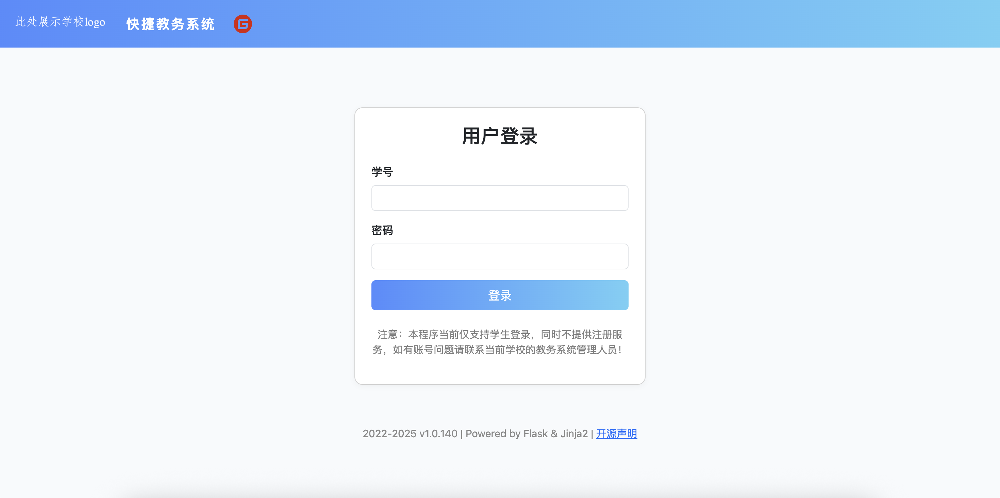
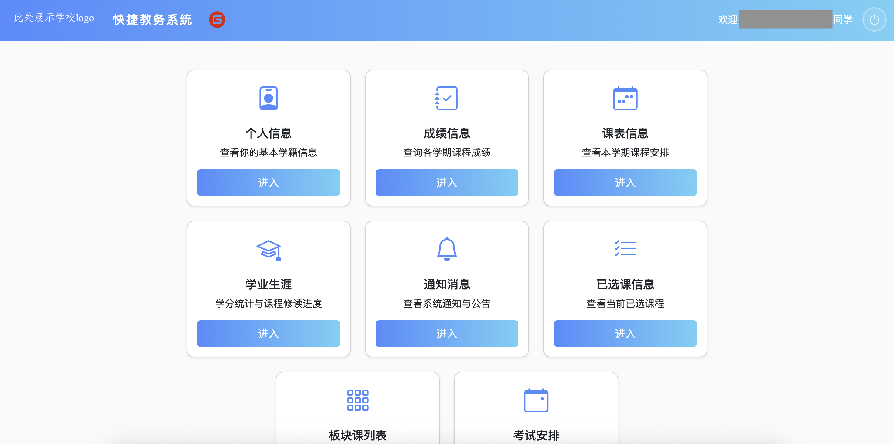

# 快捷教务系统（Easy Educational Administration Management System, EasyEAMS）

EasyEAMS 是一个基于 Flask + Jinja2 的现代化教务系统 Web 应用。学生可通过该项目的API接口链接学校教务系统进行登录，在线查询个人信息、成绩、课表、学业生涯、通知、选课等可视化操作。

<!-- truncate -->

系统界面美观，交互友好，适合高校学生自助使用和二次开发。

本项目的 api.py 文件内容参考并引用了 Github 上<a href="https://github.com/openschoolcn/zfn_api/">openschoolcn的正方教务系统 API 项目</a>，并在此基础上做了适配和优化。

## 适配/更新说明
该程序当前已经适配PC Web端以及移动设备Web端。同时我会及时项目，感兴趣的朋友可以<a href="https://gitee.com/JXX_CODE/easy-eam/releases">点击链接</a>查看/下载最新版本。

## 版本说明
当前开发的版本分为“热更新版”和“稳定发行版”。热更新版是稳定发行版的预览版本，一般新的优化创意和新支持的功能会在热更新版中上线，而稳定发行版是在更新版的基础上进行显著优化，运行更稳定。如对新的功能感兴趣的朋友可以先行体验热更新版本，遇到问题可以随时提出issue或者发送邮件给我。下面是版本推荐列表。

| 版本号               | 推荐情况         |
|----------------------|-----------------|
| v1.0.136 Stable      | 推荐！最稳定版   |
| v1.0.140 Developing  | 尝鲜，可以等等   |

## 主要功能

- **用户登录**：支持学号和密码登录，部分情况支持验证码登录。
- **个人信息**：展示学生基本信息、学籍、联系方式等。
- **成绩查询**：按学年/学期查询课程成绩，支持全年成绩一览。
- **课表查询**：按学年/学期展示课程表，课程时间、地点、教师一目了然。
- **学业生涯**：统计学分绩点、计划内外课程完成情况，课程分项明细，计划内总课程饼图可视化。
- **通知公告**：查看系统通知、公告等消息。
- **已选课程**：查询当前学年/学期已选课程，含课程详情。
- **板块课列表**：按板块编号查询可选课程。
- **考试安排**：查看当前学期考试考场安排信息。
- **安全退出**：一键安全退出系统。





## 适配不同学校教务系统说明

本系统以我的学校新版正方教务管理系统为例开发，如下图。只要你的学校使用的是新版正方教务管理系统（即新版“正方教务系统”Web端），均可直接使用本程序，无需修改核心代码。


### 切换学校教务系统网址教程

1. **找到你学校教务系统的网址**  
   一般格式为：
   ```
   https://zfjw.学校域名/jwglxt/
   ```
   例如：
   - 我学校教务管理系统网址为 `https://zfjw.ntit.edu.cn/jwglxt/`
   - 其他学校请在浏览器登录教务系统后，复制浏览器地址栏的前缀部分（直到 `/jwglxt/`）。

2. **修改后端配置**  
   打开项目根目录下的 `app.py` 文件，找到如下代码（一般在前面几行）：
   ```python
   BASE_URL = "https://zfjw.ntit.edu.cn/jwglxt/"
   ```
   将其修改为你学校的教务系统网址。例如：
   ```python
   BASE_URL = "https://zfjw.你的学校域名/jwglxt/"
   ```

3. **保存并重启服务**  
   保存 `app.py` 文件后，重启 Flask 服务：
   ```bash
   python app.py
   ```

4. **重新登录**  
   在浏览器访问首页，使用你学校的学号和密码登录即可。

> **注意事项：**  
> - 仅支持新版正方教务系统（URL 结构和页面风格与我学校类似）。
> - 若遇到兼容性问题或接口变动，请自行参考下一小节适配 `api.py` 相关接口。

### api.py 教务系统接口适配教程

有些学校的新版正方教务系统虽然大体接口一致，但部分接口路径、参数或登录方式可能略有不同。你可以通过修改 `api.py` 文件进行适配。

#### 1. 主要适配点
- BASE_URL：主机地址（已在 app.py 说明）
- 登录接口路径、参数（如 login_url、key_url、kaptcha_url 等）
- 数据接口路径（如个人信息、成绩、课表、通知等接口的 URL）
- 请求参数/字段名（部分学校字段名可能不同）
- 验证码、加密方式（部分学校登录需要验证码或特殊加密）

#### 2. 具体修改方法

**步骤一：定位接口配置**

打开 `api.py`，在 `Client` 类的 `__init__` 方法中，找到如下代码：

```python
self.base_url = kwargs.get("base_url")
self.key_url = urljoin(self.base_url, "xtgl/login_getPublicKey.html")
self.login_url = urljoin(self.base_url, "xtgl/login_slogin.html")
self.kaptcha_url = urljoin(self.base_url, "kaptcha")
# 其他接口路径...
```

如果你学校的接口路径不同，请将上述路径修改为实际路径。

**步骤二：调整接口参数**

如登录参数名不同（如 csrftoken、yhm、mm），可在 `login`、`login_with_kaptcha` 方法中调整：

```python
login_data = {
    "csrftoken": csrf_token,
    "yhm": sid,
    "mm": encrypt_password,
    # 可能还需要其他参数
}
```
如有参数名不同，按实际接口文档或抓包结果修改。

**步骤三：调整数据接口**

如成绩、课表、个人信息等接口路径或参数不同，找到对应的 `get_grade`、`get_schedule`、`get_info` 等方法，修改 `url` 和 `data` 字典即可。

**步骤四：调试与验证**

- 可用浏览器开发者工具或抓包工具（如 Fiddler、Charles）对比你学校教务系统的实际请求和响应。
- 若遇到接口报错、数据为空等，优先检查 URL 和参数是否与实际一致。

**步骤五：如需特殊适配**

- 某些学校可能有自定义加密、验证码、二次认证等特殊逻辑，可在对应方法中补充实现。
- 如需帮助，可将抓包信息或接口文档反馈给开发者。

---

#### 示例：如何修改登录接口路径

假设你学校的登录接口为 `/auth/login.html`，公钥接口为 `/auth/getKey.html`，则只需在 `api.py` 的 `__init__` 方法中：

```python
self.key_url = urljoin(self.base_url, "auth/getKey.html")
self.login_url = urljoin(self.base_url, "auth/login.html")
```

---

#### 温馨提示
- 大部分新版正方系统接口结构类似，通常只需改 URL 前缀即可。
- 若遇到复杂适配问题，建议先抓包分析，再逐步修改代码。


## 安装与运行

### 1. 克隆项目

```bash
git clone https://gitee.com/JXX_CODE/easy-eam.git
cd easy-eam
```

### 2. 安装依赖

建议使用 Python 3.8 及以上版本，推荐使用虚拟环境。

```bash
pip install -r requirements.txt
```

### 3. 准备加密用户登录信息
当前使用rsa生成公钥和私钥分别对应前端和后端，<strong>第一次使用本程序</strong>需要先运行rsa_key.py生成两串钥匙，命令如下：
```bash
python rsa_key.py
```

### 4. 启动服务

```bash
python app.py
```

默认访问地址为 `http://127.0.0.1:5000/`，可在浏览器中打开。

## 目录结构

```
easy-eam/
├── app.py                # Flask 主程序
├── api.py                # 教务系统核心逻辑
├── copyright.py          # 开源声明
├── requirements.txt      # 依赖包
├── static/               # 静态资源（图片、SVG等）
├── templates/            # 前端页面模板
└── README_zh.md          # 中文说明文档
```

## 使用说明

1. 启动后访问首页，输入学号和密码登录。
2. 登录成功后进入菜单页，点击各功能卡片进入相应页面。
3. 各页面均可通过左上角“返回菜单”按钮返回主菜单。
4. 顶栏显示当前登录学生信息，右侧可一键退出。
5. 页面底部可查看开源声明，点击弹窗显示详细内容。
6. 如需显示学校logo，仅需将学校的logo下载并命名为”school_logo.png"，放置在static/img目录下，刷新页面即可显示。

## 注意事项

:::caution
1. 本项目严禁部署在服务器上，正方教务系统会自动监测是否使用自动登录脚本并拒绝访问。
2. 本系统仅供学习交流使用，严禁用于商业或非法用途。
:::
:::tip
1. 仅支持已开通教务系统账号的学生使用。
2. 登录信息、操作日志仅保留必要内容，敏感信息不会被记录。
3. 日志自动清理，最多保留近 1 个月内容。
:::

## 开源协议

本项目遵循 GNU GPL v3 开源协议。