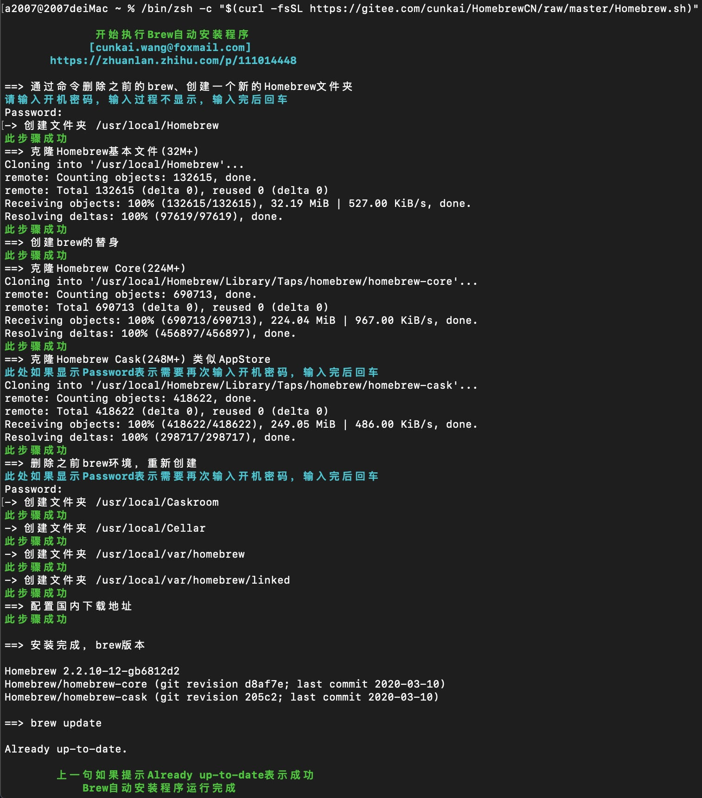

# macOS 安装 Python

## 1. 使用 Homebrew 安装（推荐）

### 1.1 安装 Homebrew

在终端执行国内一键部署脚本：

```bash
/bin/zsh -c "$(curl -fsSL https://gitee.com/cunkai/HomebrewCN/raw/master/Homebrew.sh)"
```

> 


> **如需卸载 Homebrew，可使用国内一键卸载脚本：**
>
> ```bash
> /bin/zsh -c "$(curl -fsSL https://gitee.com/cunkai/HomebrewCN/raw/master/HomebrewUninstall.sh)"
> ```

### 1.2 区分芯片类型

- **Intel 芯片**：大多数老款 Mac。
- **Apple Silicon（M1/M2/M3）芯片**：2020 年后新款 Mac。

可在“关于本机”中查看芯片类型。

### 1.3 安装 Python

- **Intel 芯片**：
```bash
brew install python@3
```
- **Apple Silicon 芯片**：
```bash
arch -arm64 brew install python@3
```
或直接用 brew 安装，Homebrew 会自动适配。

> **注意：**
> - Homebrew 安装的 Python 默认包名为 `python@3`，实际命令为 `python3`、`pip3`。
> - Apple Silicon 用户建议优先使用 arm64 终端（可在终端输入 `arch` 检查，显示 arm64 即为原生）。

<!--
> 
-->

## 2. 官网下载安装

1. 访问 [Python 官网](https://www.python.org/downloads/macos/)。
2. 下载 macOS 安装包并安装，需要注意安装包后缀是否符合当前设备芯片架构。

<!--
> 
-->

## 3. 验证安装

在终端输入：

```bash
python3 --version
pip3 --version
```

## 4. pip 包管理工具

Python 安装自带 pip，可用如下命令安装包：

```bash
pip3 install 包名
```

同时，可以更新包，如下命令：

```bash
pip3 install --upgrade 包名
```

而且，还可以卸载包，如下命令：

```bash
pip3 uninstall 包名
```

命令会询问你是否要写在，输入`y`回车即可。

如需详细步骤或遇到问题，请参考 [常见问题](./faq.md)。 
